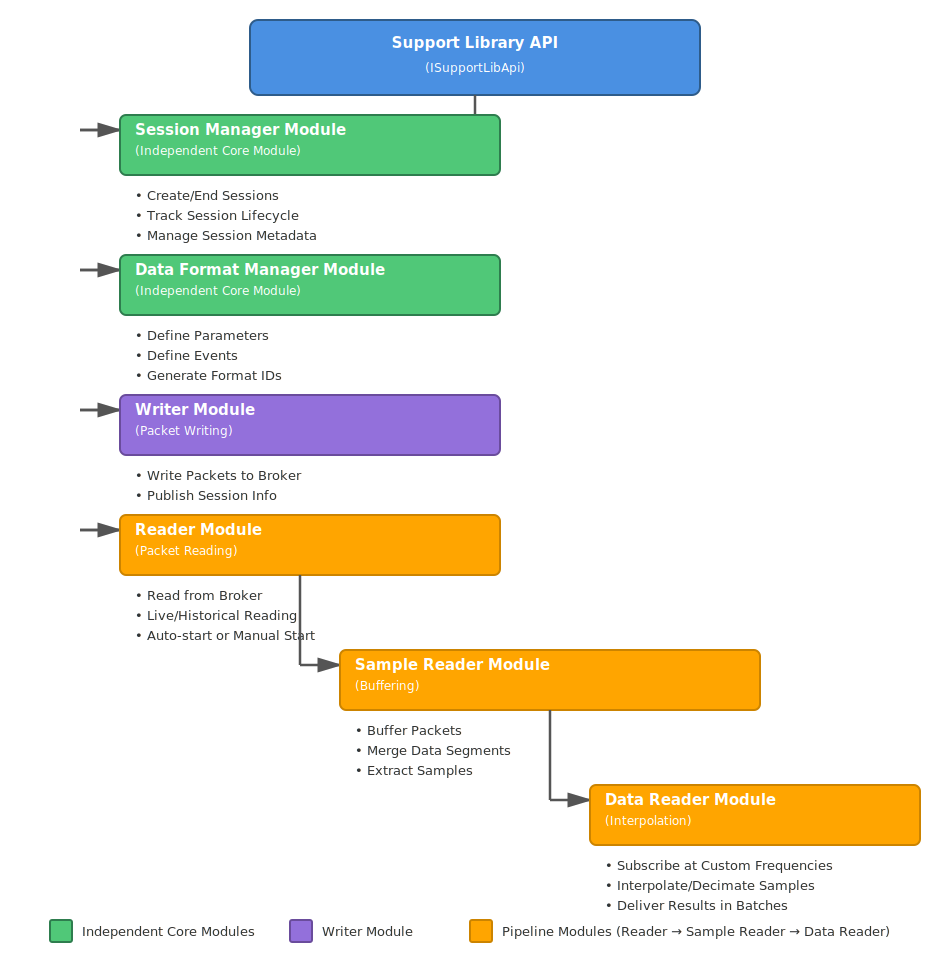

# MA DataPlatforms Streaming Support Library

## Overview

The MA DataPlatforms Streaming Support Library is a comprehensive .NET library designed to facilitate real-time and historical data streaming for motorsport telemetry and data analysis applications. The library provides a modular architecture for session management, data format handling, packet reading/writing, data buffering, merging, and interpolation.

## Key Features

- **Session Management**: Create, track, and manage live and historical sessions with metadata and associations
- **Data Format Management**: Define and manage parameter and event data formats with automatic ID generation
- **Packet Reading/Writing**: Stream packets to and from Kafka brokers with support for live and historical data
- **Buffering & Merging**: Buffer incoming data packets, merge them, and extract time-aligned samples
- **Interpolation**: Subscribe to parameters at custom frequencies with automatic super-sampling or sub-sampling
- **Event-Driven Architecture**: Rich event system for tracking session lifecycle, data availability, and processing status
- **Kafka Integration**: Built-in support for Kafka-based streaming with configurable retry policies
- **Prometheus Metrics**: Built-in monitoring and metrics support

## Architecture

The library follows a modular, pipeline-based architecture where data flows through independent but interconnected modules:



### Module Dependencies

**Independent Core Modules:**
- **Session Manager**: No dependencies on other modules
- **Data Format Manager**: No dependencies on other modules

**Dependent Modules:**
- **Writer Module**: Uses Session Manager and Data Format Manager APIs
- **Reader Module**: Can use Session Manager and Data Format Manager for context
- **Sample Reader (Buffering)**: Pipelines with Reader Module
- **Data Reader (Interpolation)**: Pipelines with Sample Reader Module

## API Response Format

All APIs in the Support Library return responses in a **consistent, standardized format** using the `ApiResult<T>` pattern. This ensures predictable error handling and makes the library easier to use.

### ApiResult<T> Pattern

Every API call returns an `ApiResult<T>` object with the following structure:

```csharp
public class ApiResult<T>
{
    public bool Success { get; }      // Indicates if operation succeeded
    public T? Data { get; }            // Contains the result data if successful
    public string Message { get; }     // Contains success/error message details
}

```

### Best Practices for Handling API Responses

#### 1. Always Check Success Status

```csharp
var result = sessionService.CreateNewSession(sessionDto);

if (result.Success && result.Data != null)
{
    // Use result.Data safely
    var sessionInfo = result.Data;
    Console.WriteLine($"Session created: {sessionInfo.SessionKey}");
}
else
{
    // Handle error
    Console.WriteLine($"Failed to create session: {result.Message}");
}

```

#### 2. Null-Safe Data Access

Even when `Success` is `true`, always check that `Data` is not null before accessing it:

```csharp
var formatResult = dataFormatService.GetParameterDataFormatId("source", parameters);

if (formatResult.Success && formatResult.Data != null)
{
    var formatId = formatResult.Data.DataFormatId;
    // Use formatId safely
}

```

#### 3. Centralized Error Handling

For applications with multiple API calls, consider creating a helper method:

```csharp
public static bool TryGetData<T>(ApiResult<T> result, out T data, Action<string>? onError = null)
{
    if (result.Success && result.Data != null)
    {
        data = result.Data;
        return true;
    }
    
    onError?.Invoke(result.Message ?? "Unknown error");
    data = default!;
    return false;
}

// Usage
if (TryGetData(sessionResult, out var sessionInfo, error => _logger.LogError(error)))
{
    // Work with sessionInfo safely
    ProcessSession(sessionInfo);
}

```

#### 4. Pattern Matching (C# 8.0+)

Use pattern matching for cleaner code:

```csharp
var result = dataFormatService.GetEventDataFormatId("source", "EventName");

var message = result switch
{
    { Success: true, Data: not null } => $"Format ID: {result.Data.DataFormatId}",
    { Success: false } => $"Error: {result.Message}",
    _ => "Unexpected result state"
};

```

### Common Response Types

- **Service Creation**: `ApiResult<ISessionManagementService>`, `ApiResult<IDataFormatManagementService>`, `ApiResult<IPacketReaderService>`, `ApiResult<ISampleReaderService>`, `ApiResult<IDataReaderService>`
- **Session Operations**: `ApiResult<ISessionInfo>`, `ApiResult<IReadOnlyList<ISessionInfo>>`
- **Data Format Operations**: `ApiResult<ParameterDataFormatInfo>`, `ApiResult<EventDataFormatInfo>`
- **Writer Operations**: `ApiResult<IPacketWriterService>`

### Note on Subscription Methods

Some operations like `Subscribe()` and `Unsubscribe()` in the Buffering and Interpolation modules return `bool` directly rather than `ApiResult<bool>`, for simpler synchronous operations.

This consistent pattern across all modules ensures:
- **Predictable error handling** throughout your application
- **Type safety** with compile-time checks
- **Clear success/failure states** without exceptions for expected failures
- **Detailed messages** for troubleshooting through the `Message` property

## Getting Started

### Installation

```bash

# Install the NuGet package (when available)
dotnet add package MA.DataPlatforms.Streaming.Support.Lib.Core

```

### Prerequisites

- .NET 8.0 or later
- Kafka broker (configured and accessible)
- Prometheus (optional, for metrics)

## Pipeline Initialization Best Practices

When using the reading pipeline (Reader → Buffering → Interpolation), **always start services from the innermost module outward** to prevent data loss due to timing issues.

### ⚠️ Critical: Startup Order

Initialization can be done in any order, but **starting services must follow this order** to ensure downstream modules are ready to receive data before upstream modules start producing it:

```
1. Interpolation Module (Data Reader)    ← START FIRST (innermost)
2. Buffering Module (Sample Reader)      ← START SECOND
3. Reader Module (Packet Reader)         ← START LAST (begins reading)
```

### Why Startup Order Matters

If you start in the wrong order (Reader → Buffering → Interpolation):
- ❌ Reader starts receiving packets from Kafka
- ❌ Buffering module is not started yet → **Packets are dropped**
- ❌ Interpolation module is not subscribed → **Data is lost**

If you start in the correct order (Interpolation → Buffering → Reader):
- ✅ Interpolation module is started and subscribed
- ✅ Buffering module is started and ready to receive
- ✅ Reader starts receiving packets → **All data is captured**

### Complete Pipeline Initialization Example

```csharp
using MA.DataPlatforms.Streaming.Support.Lib.Core.Abstractions;
using MA.DataPlatforms.Streaming.Support.Lib.Core.Contracts;

// Assume supportLibApi is already initialized and started

// Create all services (order doesn't matter for creation)
  var dataReaderApi = supportLibApi.GetDataReaderApi();
  var dataReaderService = dataReaderApi.CreateService().Data;

  var sampleReaderApi = supportLibApi.GetSampleReaderApi();
  var bufferingConfig = new BufferingConfiguration(["Param1", "Param2", "Param3"]);
  var sampleReaderService = sampleReaderApi.CreateService(bufferingConfig).Data;

  var readerApi = supportLibApi.GetReadingPacketApi();
  var readerService = readerApi.CreateService("MyDataSource","Session_Key").Data;

  // Initialize all services (order doesn't matter for initialization)
  dataReaderService.Initialise();
  sampleReaderService.Initialise();
  readerService.Initialise(); 

  // Subscribe to parameters at custom frequency
  dataReaderService.Subscribe(
      subscriptionKey: "MySubscription",
      parameterIdentifiers: new[] { "Param1", "Param2", "Param3" },
      subscriptionFrequencyHz: 100,  // 100 Hz subscription
      handler:new MyBatchResultHandler() );

  // START in correct order: INNERMOST to OUTERMOST (CRITICAL!)
  // Step 1: Start Interpolation Module FIRST
  dataReaderService.Start();

  // Step 2: Start Buffering Module SECOND
  sampleReaderService.Start();

  // Step 3: Start Reader Module LAST
  readerService.Start();

```

### Quick Reference

| Phase | Order | Modules |
|-------|-------|---------|
| **Creation** | Any order | Can create in any sequence |
| **Initialization** | Any order | Can initialize in any sequence |
| **Startup** | Inside → Out | Interpolation → Buffering → Reader ⚠️ |
| **Shutdown** | Outside → In | Reader → Buffering → Interpolation |

### Common Mistake Example

```csharp
// ❌ WRONG - Will lose data!
var reader = readerApi.CreateService(config).Data;
reader.Initialise();
reader.Start();  // Started reading!

var buffering = sampleReaderApi.CreateService(config).Data;
buffering.Initialise();
buffering.Start();  // Too late - already missing packets!

var interpolation = dataReaderApi.CreateService().Data;
interpolation.Initialise();
interpolation.Start();  // Too late - already lost data!

```

```csharp
// ✅ CORRECT - No data loss
// Create and initialize all (any order)
var interpolation = dataReaderApi.CreateService().Data;
var buffering = sampleReaderApi.CreateService(config).Data;
var reader = readerApi.CreateService(config).Data;

interpolation.Initialise();
buffering.Initialise();
reader.Initialise();

// Start in correct order: inside-out
interpolation.Start();
interpolation.Subscribe(...);  // Ready to receive

buffering.Start();
buffering.Subscribe(...);  // Ready to receive

reader.Start();  // Now start reading - pipeline is ready!

```

### Basic Usage

#### 1. Initialize the Support Library

```csharp
using MA.DataPlatforms.Streaming.Support.Lib.Core.Abstractions;
using MA.DataPlatforms.Streaming.Support.Lib.Core.Contracts;
using MA.Streaming.Core.Configs;

var logger = new ConsoleLogger();

// Configure Kafka connection using Stream API Configuration
var streamApiConfig = new StreamingApiConfiguration(
    StreamCreationStrategy.PartitionBased,
    "localhost:9094",
    []);

// Create the support library API with retry policy (the retry policy used for when the broker not available)
var supportLibApi = new SupportLibApiFactory().Create(
    logger,
    streamApiConfig,
    new RetryPolicy(10, TimeSpan.FromSeconds(5), RetryMode.Finite));

// Subscribe to initialization event
supportLibApi.Initialised += (sender, time) => {
    Console.WriteLine($"Library initialized at {time}");
};

// Initialize asynchronously
var cts = new CancellationTokenSource();
await supportLibApi.InitialiseAsync(cts.Token);

// Start the library
if (supportLibApi.IsInitialised)
{
    supportLibApi.Start();
}

```

#### 2. Create a Session

```csharp
using MA.DataPlatforms.Streaming.Support.Lib.Core.Contracts.SessionInfoModule;

 // Get the session manager API
 var sessionManagerApi = supportLibApi.GetSessionManagerApi();
 var sessionService = sessionManagerApi.CreateService().Data;

 sessionService.Initialise();
 sessionService.Start();

 // Create a new session
 var sessionResult = sessionService.CreateNewSession(
     new SessionCreationDto(
         dataSource: "MyDataSource",
         identifier: "TestSession001",
         type: "session",
         version: 1,
         utcOffset: TimeSpan.Zero,
         details: new[] {
             new SessionDetailDto("Location", "LabA"),
             new SessionDetailDto("OperatorId", "OP_123")
         }));

 if (sessionResult.Success && sessionResult.Data != null)
 {
     var sessionKey = sessionResult.Data.SessionKey;
     Console.WriteLine($"Created session: {sessionKey}");
 }

```

#### 3. Define Data Formats

```csharp
// Get the data format manager API
var dataFormatApi = supportLibApi.GetDataFormatManagerApi();
var dataFormatService = dataFormatApi.CreateService().Data;

dataFormatService.Initialise();
dataFormatService.Start();

// Define parameter format
var paramResult = dataFormatService.GetParameterDataFormatId(
    "MyDataSource",
    new[] { "Param1", "Param2", "Param3" });

if (paramResult.Success && paramResult.Data != null)
{
    var formatId = paramResult.Data.DataFormatId;
    Console.WriteLine($"Parameter format ID: {formatId}");
}

// Define event format
var eventResult = dataFormatService.GetEventDataFormatId(
    "MyDataSource",
    "LapCompleted");

```

#### 4. Write Data

```csharp
// Get the writer API
  var writerApi = supportLibApi.GetWritingPacketApi();
  var writerService = writerApi.CreateService().Data;

  writerService.Initialise();
  writerService.Start();

  // Write packet data
  writerService.WriteData(
      dataSource: "MyDataSource",
      stream: "MainStream",
      sessionKey: "Session_Key",
      packet: new Packet());

```

#### 5. Read Data

```csharp
// Get the reader API
var readerApi = supportLibApi.GetReadingPacketApi();
var readerService = readerApi.CreateService("MyDataSource", sessionKey).Data;

// Create a handler for received packets
public class MyPacketHandler : IHandler<IReceivedPacketDto>
{
    public void Handle(IReceivedPacketDto packet)
    {
        Console.WriteLine($"Received packet: {packet.Packet.Type}");
    }
}

readerService.AddHandler(new MyPacketHandler());
readerService.Initialise();
readerService.Start();

```

#### 6. Buffer and Extract Samples

```csharp
// Get the sample reader API
var sampleReaderApi = supportLibApi.GetSampleReaderApi();

// Configure buffering
var bufferingConfig = new BufferingConfiguration(
    subscribedParameters: new[] { "Param1", "Param2" },
    bufferingWindowLength: 3000,  // 3 seconds
    slidingWindowPercentage: 5);

var sampleReaderService = sampleReaderApi.CreateService(bufferingConfig).Data;

// Create a timestamp handler
public class MyTimestampHandler : IHandler<ITimestampData>
{
    public void Handle(ITimestampData data)
    {
        foreach (var column in data.TimeColumns)
        {
            Console.WriteLine($"Parameter: {column.Identifier}, Values: {column.SampleValues.Count}");
        }
    }
}

sampleReaderService.SetReaderService(readerService);
sampleReaderService.AddHandler(new MyTimestampHandler());
sampleReaderService.Initialise();
sampleReaderService.Start();

```

#### 7. Subscribe to Interpolated Data

```csharp
// Get the data reader API (interpolation)
var dataReaderApi = supportLibApi.GetDataReaderApi();
var dataReaderService = dataReaderApi.CreateService().Data;

// Create a batch result handler
public class MyBatchResultHandler : IBatchResultHandler
{
    public void Handle(BatchResult result)
    {
        Console.WriteLine($"Received {result.Results.Count} interpolated samples");
    }
}

// Set the sample reader as the data source
dataReaderService.SetSampleReaderService(sampleReaderService);

// Subscribe to parameters at 10 Hz
dataReaderService.Subscribe(
    subscriptionKey: "MySubscription",
    parameterIdentifiers: new[] { "Param1", "Param2", "Param3" },
    subscriptionFrequencyHz: 10.0,
    handler: new MyBatchResultHandler(),
    deliveryFrequencyHz: 5.0);  // Deliver results every 5 Hz

dataReaderService.Initialise();
dataReaderService.Start();

```

## Quick Links

- [Session Manager Module](session-manager.md)
- [Data Format Manager Module](data-format-manager.md)
- [Writer Module](writer-module.md)
- [Reader Module](reader-module.md)
- [Buffering Module](buffering-module.md)
- [Interpolation Module](interpolation-module.md)
- [API Reference](api-reference.md)
- [Configuration Guide](configuration.md)
- [Events Reference](events-reference.md)

## Use Cases

The library supports various data streaming scenarios:

- **Live Session Monitoring**: Stream data from live sessions and process in real-time
- **Historical Playback**: Read and analyze complete historical sessions
- **On-the-Fly Subscription**: Dynamically subscribe to parameters during a live session
- **Data Analysis**: Buffer, merge, and interpolate data for analysis applications
- **Multi-Session Association**: Link related sessions using session GUIDs

## Support and Contributing

For issues, questions, or contributions, please refer to the project repository.

## License

Copyright (c) Motion Applied Ltd.
