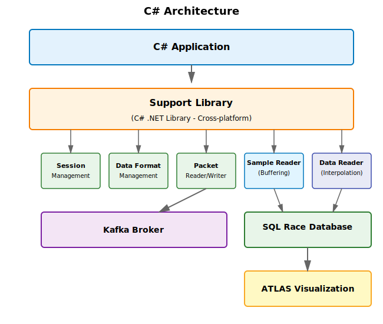

# C# Guide

## Introduction

The C# implementation uses the **NuGet package** to provide the full feature set of the MA DataPlatforms Streaming Support Library. Unlike the Python implementation which uses FFI (Foreign Function Interface) and is Windows-only, the C# library is a cross-platform .NET assembly that runs on Windows, Linux, and macOS.

## What's Available

The C# NuGet package includes all features:

**Session Management** - Create, update, and manage telemetry sessions  
**Data Format Management** - Handle parameter definitions and data format IDs  
**Packet Reading** - Read live and historic session data from the broker  
**Packet Writing** - Write telemetry data to the broker  
**Buffering** - Time-windowed data aggregation with custom merge strategies  
**Interpolation** - Statistical processing with custom processors  
**SQL Race Integration** - Direct database storage for ATLAS visualization

## Cross-Platform .NET Library

The C# library is a **standard .NET assembly** that provides:

- Cross-platform support (Windows, Linux, macOS)
- Full IntelliSense and type safety
- Maximum throughput and minimum latency
- Direct access to all advanced features
- No FFI overhead

## Architecture



## Quick Links

<div class="grid cards" markdown>

-   **Getting Started**

    ---

    Learn how to install and configure the library

    [:octicons-arrow-right-24: Installation Guide](../getting-started/installation.md)

-   **Session Management**

    ---

    Create and manage telemetry sessions

    [:octicons-arrow-right-24: Session Manager](../core-library/session-manager.md)

-   **Data Format Management**

    ---

    Handle parameter and event definitions

    [:octicons-arrow-right-24: Data Format Manager](../core-library/data-format-manager.md)

-   **Reader Module**

    ---

    Read live and historic telemetry data

    [:octicons-arrow-right-24: Packet Reader](../core-library/reader-module.md)

-   **Writer Module**

    ---

    Write telemetry data to the broker

    [:octicons-arrow-right-24: Packet Writer](../core-library/writer-module.md)

-   **Buffering Module**

    ---

    Time-windowed data aggregation

    [:octicons-arrow-right-24: Buffering API](../core-library/buffering-module.md)

-   **Interpolation Module**

    ---

    Statistical data processing

    [:octicons-arrow-right-24: Interpolation API](../core-library/interpolation-module.md)

-   **Core Library API**

    ---

    Complete API reference for all modules

    [:octicons-arrow-right-24: API Reference](../core-library/index.md)

</div>

## Key Capabilities

### Buffering Module

Aggregate streaming data into time-based windows with two data formats:

**Sample Data Mode** - One parameter per packet:

```csharp
public class SampleDataHandler : IHandler<SampleData>
{
    public void Handle(SampleData data)
    {
        var parameterId = data.ParameterIdentifier;
        var timestamps = data.Timestamps;
        var values = data.Samples;
        
        // Process buffered data
    }
}
```

**Timestamp Data Mode** - Multiple parameters per timestamp:

```csharp
public class TimestampDataHandler : IHandler<TimestampData>
{
    public void Handle(TimestampData data)
    {
        var timestamps = data.Timestamps;
        var parameterData = data.Data; // Dictionary<string, List<double>>
        
        // Process synchronized multi-parameter data
    }
}
```

### Interpolation Module

Process buffered data with built-in or custom processors:

**Default Statistical Processor:**

```csharp
dataReaderApi.Subscribe(
    subscriptionKey,
    parameterIdentifiers,
    subscriptionFrequencyHz: 2,
    handler: resultHandler,
    deliveryFrequencyHz: 2
);

// Provides: First, Last, Mean, Min, Max
```

**Custom Processor:**

```csharp
public class CustomProcessor : ISubscriptionProcessor
{
    public IReadOnlyList<IProcessResult> Process(
        string subscriptionKey,
        IReadOnlyDictionary<string, TimestampValuePair> inputData,
        ulong startTime,
        ulong endTime)
    {
        // Custom interpolation logic
        return results;
    }
}
```

### SQL Race Integration

Store processed data directly to SQL Race for ATLAS visualization:

```csharp
const string ConnectionString = 
    @"DbEngine=SQLite;Data Source=C:\Motion Applied\SupportFilesDemo\Demo.ssndb;PRAGMA journal_mode=WAL;";

Core.Initialize();
var sqlSessionManager = new SqlSessionManager(ConnectionString, parameters, logger);
```

## Sample Application

The buffering and interpolation sample in `MA.DataPlatforms.Streaming.Support.Library.SampleUsage.Buffering.Interpolation` demonstrates:

1. Connecting to Kafka broker
2. Reading live telemetry sessions
3. Buffering data with 3-second windows
4. Statistical interpolation at 2 Hz
5. Custom linear interpolation
6. Storing results in SQL Race
7. Visualization in ATLAS

Refer to `Program.cs` and inline code comments for implementation details.

## Service Initialization Pattern

All C# services follow this lifecycle:

```csharp
// 1. Create Support Library
var supportLibApi = new SupportLibApiFactory().Create(logger, streamApiConfig);
supportLibApi.Initialise();
supportLibApi.Start();

// 2. Get Module API
var moduleApi = supportLibApi.GetSampleReaderApi();

// 3. Create Service
var serviceResponse = moduleApi.CreateService(config);
var service = serviceResponse.Data;

// 4. Initialize and Start
service.Initialise();
service.Start();

// 5. Use Service
service.Subscribe(parameters);

// 6. Stop When Done
service.Unsubscribe(parameters);
service.Stop();
supportLibApi.Stop();
```

## Configuration Options

### Streaming API

```csharp
var streamApiConfig = new StreamingApiConfiguration(
    strategy: StreamCreationStrategy.TopicBased,
    brokerList: "localhost:9094",
    additionalProperties: []
);
```

### Buffering

```csharp
var bufferingConfig = new BufferingConfiguration(
    subscribedParameters: parameters,
    includeMarkerData: true,
    bufferingWindowLength: 3000,  // milliseconds
    slidingWindowPercentage: 5    // percent
);
```

### Interpolation

```csharp
dataReaderApi.Subscribe(
    subscriptionKey: Guid.NewGuid().ToString(),
    parameterIdentifiers: parameters,
    subscriptionFrequencyHz: 2,
    handler: interpolationHandler,
    deliveryFrequencyHz: 2,
    processor: customProcessor  // optional
);
```

## Requirements

- **Platform**: Cross-platform (.NET 8.0+) - Windows, Linux, macOS
- **.NET**: 8.0 or later
- **SQL Race**: Latest version (optional, for ATLAS visualization)
- **Kafka**: 2.0 or later
- **Memory**: 4GB+ recommended

## Performance Characteristics

- **Native C# Performance** - No FFI overhead
- **High Throughput** - Optimized for real-time streaming
- **Configurable Memory Usage** - Adjust buffer sizes as needed
- **Scalable Processing** - Multiple interpolation subscriptions

## Next Steps

Get started with the C# library:

1. [Install and configure](../getting-started/installation.md)
2. [Understand the architecture](../getting-started/overview.md)
3. [Explore Session Management](../core-library/session-manager.md)
4. [Learn Buffering concepts](../core-library/buffering-module.md)
5. [Explore Interpolation](../core-library/interpolation-module.md)
6. Review the sample code in `MA.DataPlatforms.Streaming.Support.Library.SampleUsage.Buffering.Interpolation`

---

!!! tip "Full Feature Access"
    The C# implementation provides access to **all features** of the Streaming Support Library, including advanced buffering and interpolation capabilities not yet available in Python.
