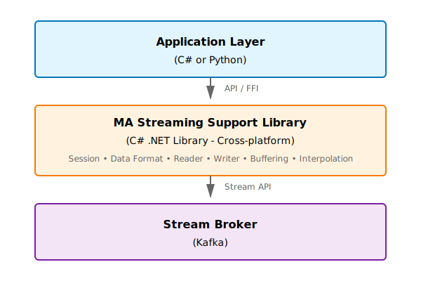

# MA DataPlatforms Streaming Support Library

Welcome to the comprehensive documentation for the **MA DataPlatforms Streaming Support Library Sample Usage**. This library enables applications to interact with Motion Applied's streaming telemetry data platform for reading, writing, buffering, and processing real-time motorsport data.

## Overview

The MA DataPlatforms Streaming Support Library is available in two implementations:

- **C# (NuGet Package)**: Cross-platform .NET 8.0+ library for maximum performance
- **Python (FFI Wrapper)**: Python bindings for Windows x64 (calls C# library via FFI)

!!! info "Platform Support"
    - **C#**: Cross-platform .NET 8.0+ library (Windows, Linux, macOS)
    - **Python**: FFI wrapper - Windows x64 only (calls C# library underneath)

## Key Features

=== "C#"

    - ✅ Session Management
    - ✅ Data Format Management
    - ✅ Packet Reading (Live & Historic)
    - ✅ Packet Writing
    - ✅ **Buffering** (Time-windowed aggregation)
    - ✅ **Interpolation** (Statistical processing)
    - ✅ SQL Race Integration

=== "Python"

    - ✅ Session Management
    - ✅ Data Format Management
    - ✅ Packet Reading (Live & Historic)
    - ✅ Packet Writing
    - 🚧 Buffering (Coming Soon)
    - 🚧 Interpolation (Coming Soon)

## Quick Links

-   :material-rocket-launch:{ .lg .middle } __Getting Started__

    ---

    Install and configure the library for your platform

    [:octicons-arrow-right-24: Get Started](getting-started/overview.md)

-   :material-language-python:{ .lg .middle } __Python Guide__

    ---

    Learn to read and write telemetry data using Python

    [:octicons-arrow-right-24: Python Docs](python/index.md)

-   :material-language-csharp:{ .lg .middle } __C# Guide__

    ---

    Master buffering and interpolation with C#

    [:octicons-arrow-right-24: C# Docs](csharp/index.md)

-   :material-book-open-variant:{ .lg .middle } __API Reference__

    ---

    Detailed API documentation and configuration options

    [:octicons-arrow-right-24: Reference](reference/configuration.md)

## Architecture

## Use Cases

### 1. Real-Time Data Monitoring
Monitor live telemetry sessions and extract specific parameter values in real-time.

**Best for**: Python or C# Packet Reader

### 2. Data Recording
Create and write telemetry sessions to the broker for recording and analysis.

**Best for**: Python or C# Packet Writer

### 3. Data Buffering & Aggregation
Aggregate streaming data into time-based windows with configurable merge strategies.

**Best for**: C# Buffering Module (Python coming soon)

### 4. Statistical Analysis
Perform real-time statistical processing with configurable frequencies.

**Best for**: C# Interpolation Module (Python coming soon)

### 5. Custom Data Processing
Implement custom interpolation algorithms for specialized data processing.

**Best for**: C# Custom Processors

## What's New in 2025 R03

!!! success "Latest Updates"
    - Comprehensive documentation in MkDocs format
    - Enhanced Python sample code with detailed comments
    - Improved C# buffering and interpolation examples
    - New custom interpolation processor examples
    - Complete API reference documentation

## System Requirements

=== "C# Application"

    - **OS**: Windows 10/11 (x64)
    - **Runtime**: .NET 8.0 or later
    - **SQL Race**: Latest version
    - **Memory**: 4GB+ recommended
    - **Broker**: Kafka 2.0+

=== "Python Application"

    - **OS**: Windows 10/11 (x64) - **Required** for native DLL
    - **Python**: 3.8 or later
    - **Memory**: 2GB+ recommended
    - **Broker**: Kafka 2.0+

## Support

For issues, questions, or feature requests:

- :material-email: Contact Motion Applied support
- :material-github: [GitHub Repository](https://github.com/mat-docs/MA.DataPlatforms.Streaming.Support.Library.SampleUsage)
- :material-file-document: Main library documentation

---

!!! tip "New to the Library?"
    Start with the [Overview](getting-started/overview.md) to understand core concepts, then follow the [Quick Start](getting-started/quick-start.md) guide for your preferred language.
