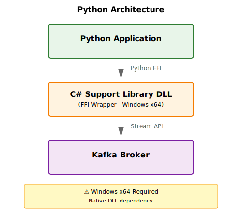

# Python Guide

## Introduction

The Python implementation of the MA DataPlatforms Streaming Support Library provides a powerful FFI (Foreign Function Interface) wrapper around the native C# library. This enables Python developers to leverage the high-performance streaming capabilities while writing in Python.

## What's Available

The Python package currently includes:

**Session Management** - Create, update, and manage telemetry sessions  
**Data Format Management** - Handle parameter definitions and data format IDs  
**Packet Reading** - Read live and historic session data from the broker  
**Packet Writing** - Write telemetry data to the broker  

Coming soon (currently C# only):
- Buffering - Time-windowed aggregation
- Interpolation - Statistical processing

## Architecture



The Python package uses **Foreign Function Interface (FFI)** to call the native Windows x64 C# DLL, providing:

- **Near-native performance** for core operations
- **Seamless interoperability** between Python and C#
- **Access to the Open Data Protocol** for telemetry streaming

!!! warning "Platform Requirement"
    **Windows x64 is required** - The Python package wraps a native Windows DLL and cannot run on Linux or macOS.

## Quick Links

<div class="grid cards" markdown>

-   **Getting Started**

    ---

    Learn how to install and configure the library

    [:octicons-arrow-right-24: Installation Guide](../getting-started/installation.md)

-   **Sample Reader**

    ---

    Read live and historic telemetry sessions

    See `Python/sample_code/sample_reader/` folder

-   **Sample Writer**

    ---

    Write telemetry data to the broker

    See `Python/sample_code/sample_writer/` folder

-   **Core Library API**

    ---

    Detailed API documentation for all modules

    [:octicons-arrow-right-24: API Reference](../core-library/index.md)

</div>

## Key Features

### Session Management

Create, manage, and query telemetry sessions:

```python
# Create a new session
session_info = SessionCreationInfo(
    data_source="Default",
    identifier="MySession",
    type="Session",
    version=1,
    utc_offset=datetime.datetime.now().astimezone().utcoffset(),
    details=[],
    associate_session_keys=[]
)

response = session_management_service.create_new_session(session_info)
```

### Data Format Management

Handle parameter definitions and format IDs:

```python
# Get data format ID for parameters
format_response = data_format_service.get_parameter_data_format_id(
    data_source="Default",
    parameter_identifiers=["vCar:Chassis", "gLat:Chassis"]
)

data_format_id = format_response.data.data_format_id
```

### Packet Reading

Read live or historic sessions:

```python
# Read live sessions
packet_reading_config = PacketReadingConfiguration(
    session_key="",
    timeout_seconds=10,
    raise_exception_on_timeout=False,
    data_source="Default",
    session_identifier_pattern="*",
    reading_type=PacketReadingType.LIVE,
    streams=[]
)

packet_reader = packet_reader_module.create_service_with_config(
    packet_reading_config
).data
```

### Packet Writing

Write data packets to the broker:

```python
# Write periodic data
packet = Packet(
    type="PeriodicData",
    session_key=session_key,
    content=periodic_packet.SerializeToString(),
    id=packet_id
)

packet_writer_service.write_data(
    data_source=data_source,
    stream=stream,
    session_key=session_key,
    packet_bytes=PacketBytes(packet.SerializeToString())
)
```

## Sample Applications

The repository includes two complete sample applications in the `Python/sample_code/` directory:

### Sample Reader

Located in `Python/sample_code/sample_reader/`, this example demonstrates:

- Connecting to the broker
- Reading live or historic sessions
- Parsing Open Data Protocol packets
- Extracting parameter samples
- Handling session events

Refer to the code and inline comments for implementation details.

### Sample Writer

Located in `Python/sample_code/sample_writer/`, this example demonstrates:

- Creating new sessions
- Defining parameters
- Writing configuration packets
- Generating periodic sample data
- Ending sessions properly

Refer to the code and inline comments for implementation details.

## Service Pattern

All Python API calls follow a consistent pattern:

```python
# 1. Bootstrap the library
support_lib_factory = SupportLibraryBootstrapper.bootstrap(config, logger)
support_lib = support_lib_factory.create()

# 2. Initialize and start
support_lib.initialise()
support_lib.start()

# 3. Get module API
module_api = support_lib.get_session_manager_api()

# 4. Create service
service_response = module_api.create_service()
service = service_response.data

# 5. Initialize and start service
service.initialise()
service.start()

# 6. Use the service
# ...

# 7. Stop when done
service.stop()
support_lib.stop()
```

## Requirements

- **Platform**: Windows 10/11 (x64 only)
- **Python**: 3.8 or later
- **Kafka**: 2.0 or later
- **Memory**: 4GB+ recommended

## Limitations

!!! info "Current Limitations"
    - **Windows x64 only** - Cannot run on Linux or macOS
    - **No buffering module** - Use C# for time-windowed aggregation (Python support planned)
    - **No interpolation module** - Use C# for statistical processing (Python support planned)
    - **No SQL Race integration** - Use C# for ATLAS visualization features

## Next Steps

New to the Python library? Start here:

1. [Install and configure](../getting-started/installation.md)
2. [Understand the architecture](../getting-started/overview.md)  
3. Explore `Python/sample_code/sample_reader/` for reading examples
4. Explore `Python/sample_code/sample_writer/` for writing examples

Need more features? Consider the C# implementation:

- [C# Guide](../csharp/index.md) - Full feature set including buffering and interpolation
- [Core Library API](../core-library/index.md) - Complete API reference

---

For questions or support, see the [Support page](../support.md).
